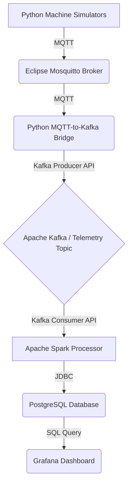

# Industrial IoT Monitoring Platform

This project implements a comprehensive, enterprise-grade Industrial IoT (IIoT) monitoring system. It captures real-time telemetry data from a fleet of simulated manufacturing machines, processes it through a scalable data pipeline, and visualizes key performance indicators (KPIs) on a live dashboard.

This system is built using modern, industry-standard big data technologies and serves as a robust template for real-world IIoT analytics applications.

***

## System Architecture

The platform is composed of several containerized services that work together to form a seamless data pipeline.

**Data Flow Diagram:**


### Core Components

| Component | Technology | Purpose |
|---|---|---|
| **Machine Simulator** | Python | Simulates a fleet of IoT devices with realistic telemetry, **ERROR states**, **scrap generation**, and **quality scoring**. |
| **MQTT Broker** | Eclipse Mosquitto | A lightweight, standard messaging broker that decouples the IoT devices from the rest of the data pipeline. |
| **MQTT-Kafka Bridge** | Python | A custom service that subscribes to all machine telemetry topics on MQTT and forwards the data into the main Kafka topic for processing. |
| **Kafka Topic Initializer**| Confluent Platform | A dedicated container that runs on startup to ensure Kafka topics are created before any other services attempt to use them, preventing startup race conditions. |
| **Stream Processor** | Apache Spark | A distributed data processing engine that consumes data from Kafka, performs real-time aggregations with **quality metrics** and **error state tracking**. |
| **Database** | PostgreSQL | Enhanced with **production scrap tracking**, **quality views**, and **machine state analysis** tables. |
| **Visualization** | Grafana & Web Dashboard | **Grafana** provides analytics dashboards. **Web Dashboard** offers system management and control interface. |
| **Web Management** ⭐ | Flask | **NEW**: Real-time system monitoring, control interface, and health management dashboard. |

## 🆕 Enhanced Features

### Quality & Scrap Tracking
- **Production Scrap Monitoring**: Real-time tracking of scrap units, reasons, and categories
- **Quality Scoring**: Dynamic quality scores based on temperature, speed, and operational conditions
- **Scrap Rate Analysis**: Automated calculation and trending of scrap rates
- **Root Cause Analysis**: Categorized scrap reasons (QUALITY, MACHINE_ERROR, MATERIAL, OPERATOR)

### Advanced Machine States
- **ERROR State**: New machine state with recovery logic and error tracking
- **State Transitions**: Enhanced Markov chain with realistic error conditions
- **Downtime Tracking**: Automated incident counting and error time measurement
- **Health Scoring**: Combined OEE, scrap rate, and error rate into overall health metric

### System Usability
- **Web Management Dashboard**: One-click system control and monitoring
- **Makefile Automation**: Simple commands for setup, operation, and maintenance
- **Health Monitoring**: Automated service health checks and connectivity tests
- **Real-time Charts**: Live system metrics and performance visualization

---

## 🚀 Quick Start Guide

### Prerequisites
*   **Docker & Docker Compose**: Latest versions installed
*   **Git**: For cloning the repository
*   **Python 3.9+**: For running data ingestion scripts
*   **Make**: For using the simplified management commands

### Step 1: Setup
```bash
git clone https://github.com/your-username/industrial-iot-monitoring.git
cd industrial-iot-monitoring

# One command setup - creates venv and installs all dependencies
make setup
```

### Step 2: Start Infrastructure
```bash
# Start all Docker services
make start
```
This will:
- Start Kafka, Spark, PostgreSQL, Grafana, MQTT broker
- Wait for services to be ready
- Show you the next steps

### Step 3: Start Data Pipeline (3 Terminals)

**Terminal 1: MQTT-Kafka Bridge**
```bash
make start-bridge
```

**Terminal 2: Machine Simulator** 
```bash
make start-simulator
```

**Terminal 3: Web Management Dashboard**
```bash
make web-dash
```

### Step 4: Access Dashboards
```bash
# Open all dashboards in browser
make dashboard
```

**Access Points:**
- **Web Management Dashboard**: http://localhost:5000 ⭐ *NEW*
- **Grafana Analytics**: http://localhost:3000 (admin/admin)
- **Kafka UI**: http://localhost:8080
- **Spark Master**: http://localhost:7080

### Management Commands
```bash
make help         # Show all available commands
make status       # Check service status
make health       # Run health checks
make logs         # View service logs
make stop         # Stop all services
make restart      # Restart system
make clean        # Clean up completely
```

---

## Accessing Services

You can monitor the system and view the data through these web interfaces:

| Service | URL | Credentials |
|---|---|---|
| **Grafana Dashboard** | `http://localhost:3000` | `admin` / `admin` |
| **Kafka UI** | `http://localhost:8080` | N/A |
| **Spark Master UI** | `http://localhost:7080` | N/A |
| **Spark Application UI**| `http://localhost:4040` | N/A |

---

## Project Structure & Key Files

*   `docker-compose.yml`: The master file for defining and running all containerized services.
*   `data_ingestion/`: Contains the Python scripts for the machine simulator and the MQTT-Kafka bridge.
    *   `machine_simulator/`: Simulates machine data. `config.py` controls its behavior.
    *   `mqtt_kafka_bridge/`: Forwards data from MQTT to Kafka. `config.yaml` controls its topics and connection settings.
*   `kafka-init/`: Contains the Dockerfile and script for the dedicated Kafka topic creation container.
*   `processing/`: Contains the Apache Spark stream processing application written in Java.
    *   `src/.../IoTProcessor.java`: The core logic for data aggregation and writing to the database.
*   `config/init.sql`: The SQL script used to initialize the PostgreSQL database schema.
*   `monitoring/`: Contains all Grafana configuration.
    *   `dashboards/iot-monitoring-dashboard.json`: The JSON definition for the main Grafana dashboard.

---
## Troubleshooting

- **Grafana panels show "No Data"**: Ensure both the `machine_simulator.py` and `mqtt_kafka_bridge.py` scripts are running locally in separate terminals.
- **`iot-processor` crashes on startup**: This was a historical issue. The `kafka-init` container should prevent this, but if it occurs, check its logs with `docker compose logs kafka-init`.
- **Can't connect to Kafka/MQTT from local scripts**: Ensure the services are running with `docker compose ps` and that no firewalls are blocking the exposed ports (e.g., `1883` for MQTT, `29092` for Kafka).