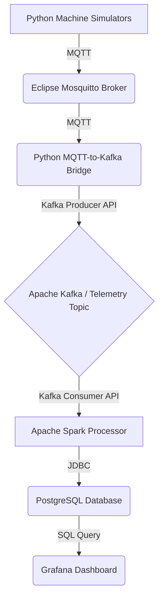

# Industrial IoT Monitoring Platform

This project implements a comprehensive, enterprise-grade Industrial IoT (IIoT) monitoring system. It captures real-time telemetry data from a fleet of simulated manufacturing machines, processes it through a scalable data pipeline, and visualizes key performance indicators (KPIs) on a live dashboard.

This system is built using modern, industry-standard big data technologies and serves as a robust template for real-world IIoT analytics applications.

***

## System Architecture

The platform is composed of several containerized services that work together to form a seamless data pipeline.

**Data Flow Diagram:**


### Core Components

| Component | Technology | Purpose |
|---|---|---|
| **Machine Simulator** | Python | Simulates a fleet of IoT devices, each generating realistic telemetry (temperature, speed, job progress, etc.) and publishing it to MQTT. |
| **MQTT Broker** | Eclipse Mosquitto | A lightweight, standard messaging broker that decouples the IoT devices from the rest of the data pipeline. |
| **MQTT-Kafka Bridge** | Python | A custom service that subscribes to all machine telemetry topics on MQTT and forwards the data into the main Kafka topic for processing. |
| **Kafka Topic Initializer**| Confluent Platform | A dedicated container that runs on startup to ensure Kafka topics are created before any other services attempt to use them, preventing startup race conditions. |
| **Stream Processor** | Apache Spark | A distributed data processing engine that consumes data from Kafka, performs real-time aggregations (e.g., 5-minute windows), and writes the results to the database. |
| **Database** | PostgreSQL | A reliable relational database used to store the aggregated time-series data and machine KPIs. |
| **Visualization** | Grafana & Kafka UI | **Grafana** provides the main real-time monitoring dashboard. **Kafka UI** allows for easy inspection of Kafka topics and messages. |

---

## How to Run the Platform

Follow these steps to set up and run the entire system on your local machine.

### Prerequisites
*   **Docker & Docker Compose**: Ensure you have the latest versions installed. This is the only dependency required.
*   **Git**: For cloning the repository.
*   **Python 3.9+**: For running the local data ingestion scripts.

### Step 1: Clone the Repository
```bash
git clone https://github.com/your-username/industrial-iot-monitoring.git
cd industrial-iot-monitoring
```

### Step 2: Set Up the Python Virtual Environment
All data ingestion scripts (simulator, bridge) are run locally. Create a virtual environment and install the required packages.
```bash
# Create the virtual environment
python3 -m venv venv

# Activate it (macOS/Linux)
source venv/bin/activate
# On Windows, use: venv\Scripts\activate

# Install all dependencies
pip install -r data_ingestion/machine_simulator/requirements.txt
pip install -r data_ingestion/mqtt_kafka_bridge/requirements.txt
```

### Step 3: Start the Core Infrastructure
This command will build and start all the necessary services (Kafka, Spark, Postgres, Grafana, etc.) in the correct order. The `--build` flag ensures any changes are applied.
```bash
# This will start all services defined in the main docker-compose file
# and the services in the "spark-processing" profile.
docker compose --profile spark-processing up --build -d
```
The first time you run this, Docker will download all the necessary images, which may take a few minutes. The `kafka-init` container will run, create the topics, and then exit.

### Step 4: Start the Data Ingestion Scripts
With the infrastructure running, you now need to start the two Python scripts that generate and forward the data.

**Important:** You will need **two separate terminal windows**. In each one, you must first activate the virtual environment. The commands must be run from the project's root directory.

**Terminal 1: Start the MQTT-to-Kafka Bridge**
This service listens for messages from the simulator and forwards them to Kafka.

```bash
# Activate the virtual environment
source venv/bin/activate

# From the project root, run the bridge module
python -m data_ingestion.mqtt_kafka_bridge.mqtt_kafka_bridge
```
You should see logs indicating it has connected to both MQTT and Kafka and is now subscribing to `factory/machines/+/telemetry`. It will appear to be idle, which is the correct behavior while it waits for messages.

**Terminal 2: Start the Machine Simulator**
This service simulates the machines and generates the data.

```bash
# Open a NEW terminal and activate the virtual environment
source venv/bin/activate

# From the project root, run the simulator module
python -m data_ingestion.machine_simulator.machine_simulator
```
You will see logs as the simulation starts and runs its iterations. The window for Terminal 1 (the bridge) should immediately become active, showing that it is receiving and forwarding messages.

### Step 5: Everything is Running!
At this point, the entire data pipeline is active. Data is flowing from the simulator to Grafana.

---

## 🌐 Accessing Services

You can monitor the system and view the data through these web interfaces:

| Service | URL | Credentials |
|---|---|---|
| **Grafana Dashboard** | `http://localhost:3000` | `admin` / `admin` |
| **Kafka UI** | `http://localhost:8080` | N/A |
| **Spark Master UI** | `http://localhost:7080` | N/A |
| **Spark Application UI**| `http://localhost:4040` | N/A |

---

## ⚙️ Project Structure & Key Files

*   `docker-compose.yml`: The master file for defining and running all containerized services.
*   `data_ingestion/`: Contains the Python scripts for the machine simulator and the MQTT-Kafka bridge.
    *   `machine_simulator/`: Simulates machine data. `config.py` controls its behavior.
    *   `mqtt_kafka_bridge/`: Forwards data from MQTT to Kafka. `config.yaml` controls its topics and connection settings.
*   `kafka-init/`: Contains the Dockerfile and script for the dedicated Kafka topic creation container.
*   `processing/`: Contains the Apache Spark stream processing application written in Java.
    *   `src/.../IoTProcessor.java`: The core logic for data aggregation and writing to the database.
*   `config/init.sql`: The SQL script used to initialize the PostgreSQL database schema.
*   `monitoring/`: Contains all Grafana configuration.
    *   `dashboards/iot-monitoring-dashboard.json`: The JSON definition for the main Grafana dashboard.

---
## Troubleshooting

- **Grafana panels show "No Data"**: Ensure both the `machine_simulator.py` and `mqtt_kafka_bridge.py` scripts are running locally in separate terminals.
- **`iot-processor` crashes on startup**: This was a historical issue. The `kafka-init` container should prevent this, but if it occurs, check its logs with `docker compose logs kafka-init`.
- **Can't connect to Kafka/MQTT from local scripts**: Ensure the services are running with `docker compose ps` and that no firewalls are blocking the exposed ports (e.g., `1883` for MQTT, `29092` for Kafka).